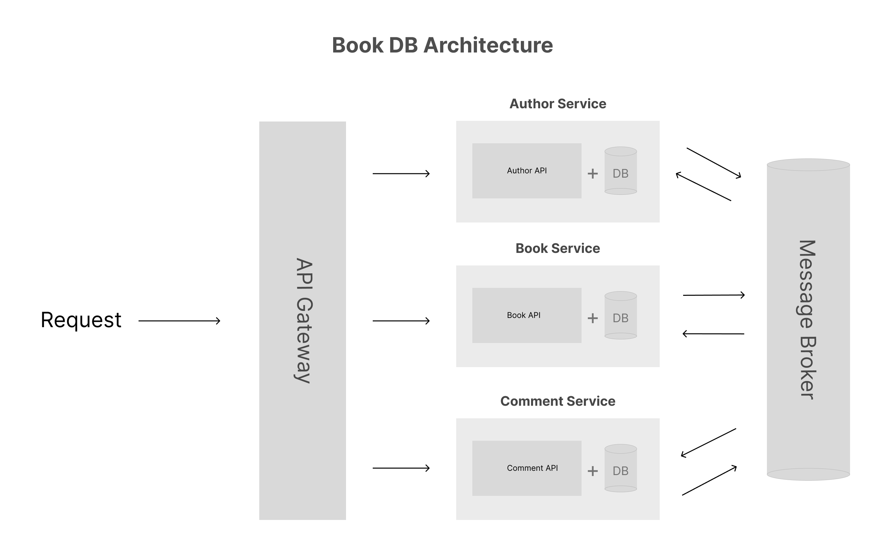

<h1 align="center">Book DB (microservice)</h1>

# Architecture


# How to deploy

## Docker-compose

```
docker-compose up -d
```

## Kubernetes

You need to have `kubectl` CLI installed on the host machine

```
./deployment_k8s.sh
```

# Github actions pipeline
Docker images will be built and push to Docker hub through github actions pipeline. To make it work, you need to fork this repo and add two "secrets" values, which are:

- DOCKER_ACCOUNT - Docker hub account name
- DOCKER_PASSWORD - Docker account password or access token

You can add these "secrets" from `Settings` -> `Secrets` -> `Actions` in Github.
